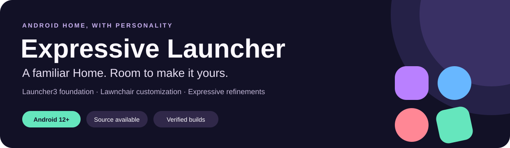

<p align="center">
  
</p>

<p align="center">
  <strong><a href="https://github.com/denson9874/ExpressiveLauncher/releases/tag/v2.0.8-26">Download 2.0.8 Stable</a></strong> ·
  <strong><a href="https://github.com/denson9874/ExpressiveLauncher/releases">All Releases</a></strong> ·
  <strong><a href="#whats-new-in-version-208-stable">What's New</a></strong> ·
  <strong><a href="#what-you-can-do">Features</a></strong> ·
  <strong><a href="docs/FEATURE_COMPARISON.md">Compare Features</a></strong> ·
  <strong><a href="docs/BUILDING.md">Build from Source</a></strong> ·
  <strong><a href="https://github.com/denson9874/ExpressiveLauncher/issues">Report an Issue</a></strong>
</p>

# Expressive Launcher

**A focused, Pixel-inspired Home experience for Android 12 through Android 17.** Expressive builds on the real [Launcher3](https://android.googlesource.com/platform/packages/apps/Launcher3/) foundation through [Lawnchair 16](https://github.com/LawnchairLauncher/lawnchair), keeping Launcher3 authoritative for the workspace, favorites database, app drawer, folders, widgets, and gestures, while refining everyday customization, accessibility, visual design, and update delivery.

The application package is `dev.launcher.expressive.l3`. Debug builds add the standard `.debug` suffix (`dev.launcher.expressive.l3.debug`) and can coexist cleanly with upstream Lawnchair and previous test builds.

---

## Get Expressive

**Featured Stable Release: [Expressive Launcher 2.0.8 Stable — The Grand Unification](https://github.com/denson9874/ExpressiveLauncher/releases/tag/v2.0.8-26)**  
*Tag `v2.0.8-26` · Version `2.0.8` (versionCode `26`) · Android 12 through Android 17 (API 31–37) · Signed with official release certificate*

| Asset | Description |
| --- | --- |
| **[Download Stable APK](https://github.com/denson9874/ExpressiveLauncher/releases/download/v2.0.8-26/ExpressiveLauncherL3-2.0.8-Android17-QPR2-Beta5-Jenkins-Release-release-signed.apk)** | Official signed 2.0.8 Stable release APK (~22.8 MB, 23,943,857 bytes). |
| **[Release Notes](https://github.com/denson9874/ExpressiveLauncher/releases/tag/v2.0.8-26)** | Full release notes, change breakdown, humor, and riddle. |
| **[Release Report](https://github.com/denson9874/ExpressiveLauncher/releases/download/v2.0.8-26/ExpressiveLauncherL3-2.0.8-Android17-QPR2-Beta5-Jenkins-Release-release-signed-Release-report.md)** | Jenkins build identity, unit test totals, and automated verification evidence. |
| **[Package Metadata](https://github.com/denson9874/ExpressiveLauncher/releases/download/v2.0.8-26/ExpressiveLauncherL3-2.0.8-Android17-QPR2-Beta5-Jenkins-Release-release-signed-metadata.json)** | Cryptographic SHA-256 hash, certificate lineage, package name, and version codes. |
| **[Stable Branch](https://github.com/denson9874/ExpressiveLauncher/tree/stable)** | Release publication branch tracking immutable distribution evidence. |
| **[Stable Update Feed](https://raw.githubusercontent.com/denson9874/ExpressiveLauncher/updates/release/latest.json)** | In-app updater manifest for the stable channel. |

> **Looking for QA builds?**  
> Check out **[Expressive Launcher 2.0.8 QA](https://github.com/denson9874/ExpressiveLauncher/releases/tag/qa-v2.0.8-26)** (`qa-v2.0.8-26`) with direct download: [Download QA APK](https://github.com/denson9874/ExpressiveLauncher/releases/download/qa-v2.0.8-26/ExpressiveLauncherL3-2.0.8-Android17-QPR2-Beta5-Jenkins-QA-release-signed.apk) · [QA Update Manifest](https://raw.githubusercontent.com/denson9874/ExpressiveLauncher/updates/qa-v2/latest.json).

### Stable APK Verification
```text
SHA-256: f0368d2af067fd64eec9e688b813999d80e17d6e2ed16979d444671b56bff703
Size:    23,943,857 bytes
Package: dev.launcher.expressive.l3
Version: 2.0.8 (code 26)
```

---

## What's New in Version 2.0.8 Stable

Version 2.0.8 leaps from the 1.0.16 stable series into the unified 2.0 architecture, delivering broader device compatibility, deeply requested customization controls, crucial bug fixes, and rooted gesture support:

- 📱 **Broad Android 12+ Device Compatibility (Issue #15)**:
  - Lowered minimum SDK from 37 to **31** (Android 12), enabling full support for Android 12, 13, 14, 15, 16, and 17 (Baklava).
  - Restored APK Signature Schemes **v1 (JAR signing)** and **v3** alongside v2, ensuring seamless package installation across Android 12–15 without signature verification failures.
- 🎛️ **Dedicated Widget Preferences & Custom Corner Radius (Issue #12)**:
  - **Dynamic Corner Radius Slider**: Adjust widget corner radius smoothly between **0 dp** (crisp, sharp corners) and **40 dp** (ultra-rounded), dynamically enforced across all home screen widgets via `RoundedCornerEnforcement`.
  - **Widget Padding Factor**: Fine-tune spacing and margins between widgets from **0%** to **200%**.
  - **Layout & Sizing Controls**: Toggle forced rounded corners, allow widget overlap, unlock unlimited sizing, and force-resize stubborn widgets under **Settings > Widgets** and **Home Screen > Widgets**.
- 🔍 **Instant Settings Search (Issue #13)**:
  - Fast, responsive search bar directly in the Settings Dashboard header bar.
  - Multi-token keyword filtering indexing titles, summaries, categories, and keywords across all 12 preference sections with direct deep links to any setting.
- ⚡ **Quickstep & QuickSwitch Root Support (Issue #10)**:
  - Full system recents, task switching, and gesture transitions when installed as a privileged component (`/system/priv-app`) via QuickSwitch.
  - **Zero-overhead safety**: Conditioned privileged background binding on `STATUS_BAR_SERVICE` permission checks with capped connection attempts, ensuring unrooted devices experience zero battery drain, zero background loops, and zero crashes.
- 💾 **Reliable Nova Backup Persistence (Issue #14)**:
  - Resolved an issue where imported Nova Launcher backups were overwritten with default Google/AOSP favorites after a device reboot. Restored layouts now permanently persist.
- 🛡️ **Workspace & Widget Crash Prevention (Issue #11)**:
  - Fixed an unhandled `NullPointerException` crash in `UiThreadHelper` when changing icon size, grid dimensions, or display settings with active widgets on the workspace.
- 📐 **Dashboard Navigation & Tablet Improvements**:
  - Restored reachable Advanced settings rows in the dashboard and improved two-pane tablet layout responsiveness.

---

## What You Can Do

- **Make Home your own:** Personalize icon packs, adaptive shapes (circle, squircle, rounded square, arch, teardrop), fonts, colors, and grid layouts. Material 3 Expressive styling dynamically follows your wallpaper and system palette with live preview feedback.
- **Icon customization out of the box:** Lawnicons is selected as the first-run default when installed, with System icons as automatic fallback. Full support for dynamic calendar icons and third-party icon packs using ADW/Nova `appfilter.xml`.
- **Keep essential info in view:** Native At a Glance provides current date and weather with robust recovery when weather bindings become stale. Optional Smartspacer integration is supported for extensible external smart cards.
- **Google Discover beside Home:** Install or update the bundled Expressive Feed support component through a guided flow in settings, then access Google Discover right beside your primary Home screen.
- **Find things instantly:** Fast local and global search covering apps, contacts, and web suggestions. Contact actions include clear, accessible Call and Message labels.
- **Stay on a verified update path:** Check for updates in **Home settings → About** or enable update notifications. Before opening the system installer, Expressive validates the downloaded APK's package name, version progression, SHA-256 checksum, and cryptographic signing lineage.

---

## How Expressive Compares


**[Read the detailed feature comparison and architectural scope](docs/FEATURE_COMPARISON.md).**

- **AOSP Launcher3** supplies the core Android launcher architecture (workspace coordinates, favorites database, All Apps view, widget host lifecycle, drag-and-drop mechanics).
- **Lawnchair 16** provides the extensive customization toolkit (Compose-driven preferences, icon pack engine, global search architecture, Smartspace framework).
- **Expressive Launcher** contributes focused settings navigation, dedicated widget corner roundness and padding controls, instant settings search, reliable backup restore, safe Quickstep/QuickSwitch root support, Android 12–17 testing, and a fully automated continuous delivery and verification pipeline.

---

## Install and Update

### Requirements
- Any device running **Android 12 (API 31)** through **Android 17 (API 37)**.
- Standard installation requires no root permissions.

### Clean Install or Upgrade
1. Download the official **[2.0.8 Stable APK](https://github.com/denson9874/ExpressiveLauncher/releases/download/v2.0.8-26/ExpressiveLauncherL3-2.0.8-Android17-QPR2-Beta5-Jenkins-Release-release-signed.apk)** from GitHub Releases.
2. Open the APK and approve installation. If upgrading from stable version 1.0.16, the update installs directly over the existing installation and preserves all layouts and settings.
3. Set **Expressive Launcher** as your default Home app when prompted, or configure it under **Settings → Apps → Default apps → Home app**.
4. Open **Home settings → About** to check for updates or enable update notifications.

---

## Quality Assurance & Validation

Every release of Expressive Launcher undergoes rigorous multi-layer verification:

- **Automated Unit Tests**: Full Gradle unit test suite passed.
- **CI Contract & Release Verification**: All **266** CI contract tests passed (`ci/tests/`), verifying release gates, history coverage, manifest schema, and publication integrity.
- **Isolated Android 17 Upgrade QA**: Validated in an isolated Android 17 emulator, testing authentic upgrade from stable baseline 1.0.16 (code 17) to 2.0.8 (code 26). Verified preference retention, cold/warm start latency, home transitions, drawer swipes, local search, date handoff, and zero crash/ANR log events.
- **Release Signing Lineage**: Signed with durable release certificate `c14160306d5c059b3d119f15fb74e08c57cc272316e80b36e192c71dc9e4d0d2`.

---

## Source and Development

### Prerequisites
- **Java**: JDK 21 (configured via `JAVA_HOME`)
- **Android SDK**: `compileSdk 37`, minor API level 1 (Android SDK 37.1), `minSdk 31`, Build-Tools & Platform-Tools
- **Git**: Submodules support enabled

### Clone and Build

```sh
# Clone with recursive submodules
git clone --recurse-submodules https://github.com/denson9874/ExpressiveLauncher.git
cd ExpressiveLauncher

# Assemble the developer debug APK
./gradlew assembleLawnWithQuickstepExpressiveDebug
```

The output APK will be generated at:
```text
build/outputs/apk/lawnWithQuickstepExpressive/debug/
```

### Run Tests

```sh
# Run unit tests
./gradlew testLawnWithQuickstepExpressiveDebugUnitTest

# Run CI contract & release pipeline tests
python3 -m unittest discover -s ci/tests -v
```

For complete build configuration, signing setup, and test scopes, see the **[Build Guide](docs/BUILDING.md)**.

### Repository Layout

| Directory | Purpose |
| --- | --- |
| [`lawnchair/`](lawnchair/) | Customization engine, Compose preferences, search providers, and Expressive UI. |
| [`src/`](src/) · [`quickstep/`](quickstep/) | AOSP Launcher3 base classes, workspace, and Quickstep integration. |
| [`expressive/`](expressive/) · [`expressiveFeed/`](expressiveFeed/) | Product manifest, branding resources, and Google Discover support component. |
| [`tests/`](tests/) | Unit, Robolectric, and regression test suites. |
| [`ci/`](ci/) | Jenkins pipelines, release promotion scripts, and automated test gates. |
| [`docs/`](docs/) | Architecture, build instructions, and feature specifications. |

---

## Credits and Licensing

Expressive Launcher is open-source software licensed under the **[Apache License 2.0](LICENSE)**.

It builds upon the incredible work of:
- **[AOSP Launcher3](https://android.googlesource.com/platform/packages/apps/Launcher3)**: Android's reference Home implementation (Apache 2.0).
- **[Lawnchair](https://github.com/LawnchairLauncher/lawnchair)**: The open-source launcher customization project (Apache 2.0).

Upstream commit history and copyright notices are faithfully retained. See **[Third-Party Notices](docs/THIRD_PARTY_NOTICES.md)** for detailed component licenses, including the Google Sans Flex font license (SIL Open Font License 1.1) and Calculator component license (MIT).

*Expressive Launcher is an independent open-source project and is not affiliated with, sponsored by, or endorsed by Google LLC or the Lawnchair project.*
