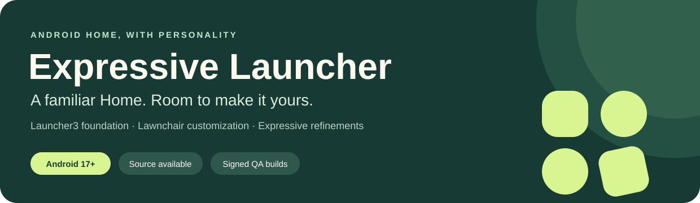
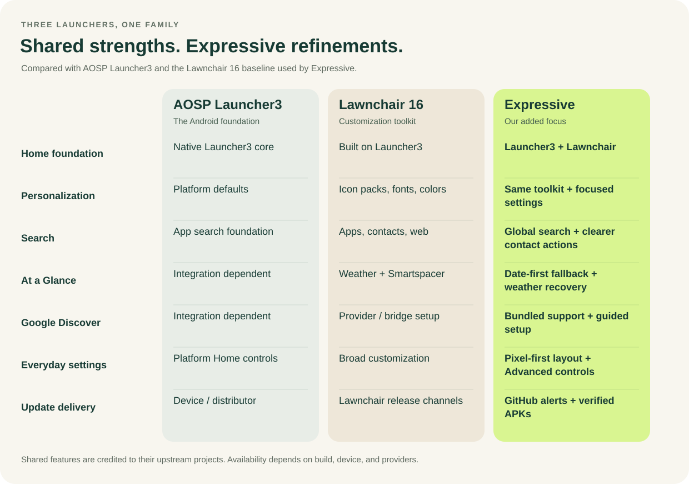

<p align="center">
  <strong><a href="https://github.com/denson9874/ExpressiveLauncher/releases">Download builds</a></strong> ·
  <strong><a href="docs/BUILDING.md">Build from source</a></strong> ·
  <strong><a href="docs/FEATURE_COMPARISON.md">Compare features</a></strong> ·
  <strong><a href="https://github.com/denson9874/ExpressiveLauncher/issues">Report an issue</a></strong>
</p>

# Expressive Launcher

**A focused, Pixel-inspired Home experience for Android 17.** Expressive builds on the real [Launcher3](https://android.googlesource.com/platform/packages/apps/Launcher3/) foundation through [Lawnchair](https://github.com/LawnchairLauncher/lawnchair), keeping its familiar Home screens, app drawer, folders, widgets, and customization while refining everyday setup, interactions, and updates.

This repository contains the **application source, build instructions, signed QA downloads, and release verification files**. The current source snapshot is **1.0.12 / version code 13**. See [source provenance](docs/SOURCE_PROVENANCE.md) for the upstream baseline and the relationship to published builds.

## Get Expressive

**Featured QA build: [1.0.12](https://github.com/denson9874/ExpressiveLauncher/releases/tag/qa-v1.0.12-13)** · Android 17 / API 37 minimum · Signed for the Expressive QA channel.

| File | What you get |
| --- | --- |
| **[Download the APK](https://github.com/denson9874/ExpressiveLauncher/releases/download/qa-v1.0.12-13/ExpressiveLauncherL3-1.0.12-Android17-QPR2-Beta4-Jenkins-QA-release-signed.apk)** | Installable Expressive Launcher 1.0.12 QA app, about 21.8 MB. |
| [QA report](https://github.com/denson9874/ExpressiveLauncher/releases/download/qa-v1.0.12-13/ExpressiveLauncherL3-1.0.12-Android17-QPR2-Beta4-Jenkins-QA-release-signed-QA-report.md) | Build identity, automated test totals, and verification summary. |
| [Package metadata](https://github.com/denson9874/ExpressiveLauncher/releases/download/qa-v1.0.12-13/ExpressiveLauncherL3-1.0.12-Android17-QPR2-Beta4-Jenkins-QA-release-signed-metadata.json) | Package, version, size, SHA-256, and signing-certificate information. |
| [Device test results](https://github.com/denson9874/ExpressiveLauncher/releases/download/qa-v1.0.12-13/ExpressiveLauncherL3-1.0.12-Android17-QPR2-Beta4-Jenkins-QA-release-signed-qa-result.json) | Results from the isolated Android upgrade and smoke tests. |
| [Application source](https://github.com/denson9874/ExpressiveLauncher/tree/main) | Browse the project, resources, tests, and build scripts. |

**[All releases and older builds](https://github.com/denson9874/ExpressiveLauncher/releases)** · **[Download/file guide](downloads/README.md)** · **[QA update manifest](https://raw.githubusercontent.com/denson9874/ExpressiveLauncher/updates/qa/latest.json)**

APKs and reports live in versioned GitHub Releases. The source is browsable in the repository's main file list. QA builds are prereleases for testing; the stable channel is separate and has no published stable release at this snapshot.

## What you can do

- **Make Home your own.** Choose icon packs, shapes, fonts, colors, grid layouts, and other Lawnchair customization options, with Material 3 Expressive styling that can follow wallpaper and system colors.
- **Find things quickly.** Search apps, contacts, and the web; enable additional search sources in settings. Contact actions have clear Call and Message accessibility labels.
- **Keep useful information in view.** Use At a Glance for the date and available weather, with optional Smartspacer integration. Expressive adds a date-first fallback and recovery when the weather connection becomes stale.
- **Set up Google Discover from Home settings.** Install or update the bundled Expressive Feed support through a guided flow, then access Google's feed beside the first Home page.
- **Customize without losing your place.** Everyday controls are grouped in a Pixel-inspired Home settings layout, with additional controls together under Advanced. Category animations respect Android's animation setting.
- **Stay on a verified update path.** Enable update notifications, open a newer matching build, or snooze the reminder. The app validates the downloaded APK before handing installation to Android.

## How Expressive compares



**[Read the accessible comparison table and supporting sources](docs/FEATURE_COMPARISON.md).**

Launcher3 supplies the launcher foundation. Lawnchair adds the customization toolkit, including icon packs, Material 3 Expressive theming, global search, and Smartspacer support. **Expressive's contribution is its focused settings and setup experience, selected interaction and accessibility refinements, Android 17 validation, and its own verified GitHub delivery flow.** Shared features are credited to their upstream projects; this is a comparison of implementations and priorities, not a performance ranking.

## Install and update

1. Use an Android 17 or newer device and download the signed QA APK from this repository's Releases.
2. Open the APK and approve installation in Android. If prompted, allow installation from the app you used to open the download.
3. Select **Expressive Launcher L3** as your default Home app when prompted, or choose it in Android's **Default apps → Home app** settings.
4. Open **Home settings → About** to check for updates and enable update notifications. Grant notification permission when requested.

QA uses `dev.launcher.expressive.l3.debug`; stable uses `dev.launcher.expressive.l3`. Each installation checks only its own channel. Compatible signed QA updates install over the existing QA app. A locally built developer Debug APK has a different signing identity and cannot replace an official signed QA installation in place.

The updater checks periodically when Android schedules it and a network is available. Before opening Android's installer, it checks the APK's **size, SHA-256, package, version, and signing lineage**. You confirm installation in the system interface. [Update and channel details](docs/DIRECT_DISTRIBUTION.md).

## What has been validated

The published **1.0.12 QA** build passed **167 application tests, 104 pipeline checks, and 11 isolated Android device checks**. Additional physical Pixel 11 Pro XL testing verified weather toggles, settings reopening, restart persistence, and retained widget bindings. A genuine 1.0.11 installation also received the automatic GitHub update notification and opened the correct 1.0.12 offer. The downloadable [QA report](https://github.com/denson9874/ExpressiveLauncher/releases/download/qa-v1.0.12-13/ExpressiveLauncherL3-1.0.12-Android17-QPR2-Beta4-Jenkins-QA-release-signed-QA-report.md) and [device results](https://github.com/denson9874/ExpressiveLauncher/releases/download/qa-v1.0.12-13/ExpressiveLauncherL3-1.0.12-Android17-QPR2-Beta4-Jenkins-QA-release-signed-qa-result.json) describe the automated build's scope.

Expressive runs as a standard Home app; root is not required for that role. Android still owns system Recents and gesture navigation. Weather needs an available provider and approval; Discover needs the Google app and the bundled support component installed; Smartspacer is optional external software. The full Android 17 Launcher3 core port remains in progress. See [architecture and port status](docs/ANDROID17_PORT.md).

## Source and development

```sh
git clone --recurse-submodules https://github.com/denson9874/ExpressiveLauncher.git
cd ExpressiveLauncher
./gradlew --no-scan assembleLawnWithQuickstepExpressiveDebug
```

Use **JDK 21** and the **Android 37.1 SDK**. The SystemUI submodule is required: ordinary GitHub ZIP downloads omit its contents. The [build guide](docs/BUILDING.md) includes dependency setup, output locations, test commands, and signing instructions.

| Project area | Contents |
| --- | --- |
| [`lawnchair/`](lawnchair/) | Launcher customization, settings, search, and Expressive app behavior. |
| [`src/`](src/) · [`quickstep/`](quickstep/) | Launcher3 foundation and integration code. |
| [`expressive/`](expressive/) · [`expressiveFeed/`](expressiveFeed/) | Product branding/configuration and Discover support. |
| [`tests/`](tests/) | App and interaction regression coverage. |
| [`ci/`](ci/) | Jenkins build, verification, and release tooling. |
| [`docs/`](docs/) | Build, architecture, feature, and delivery documentation. |

For contributions, start with [CONTRIBUTING.md](CONTRIBUTING.md). Report Expressive issues in [this repository](https://github.com/denson9874/ExpressiveLauncher/issues).

## Credits and license

Expressive stands on the work of **AOSP Launcher3**, **Lawnchair**, and their contributors. It is an independent project; it is not an official Google, Pixel, or Lawnchair release.

The retained [Apache License 2.0 and AOSP/Lawnchair notices](LICENSE.txt) apply alongside each component's own notices. See [third-party notices](docs/THIRD_PARTY_NOTICES.md), including the Google Sans Flex font license.
