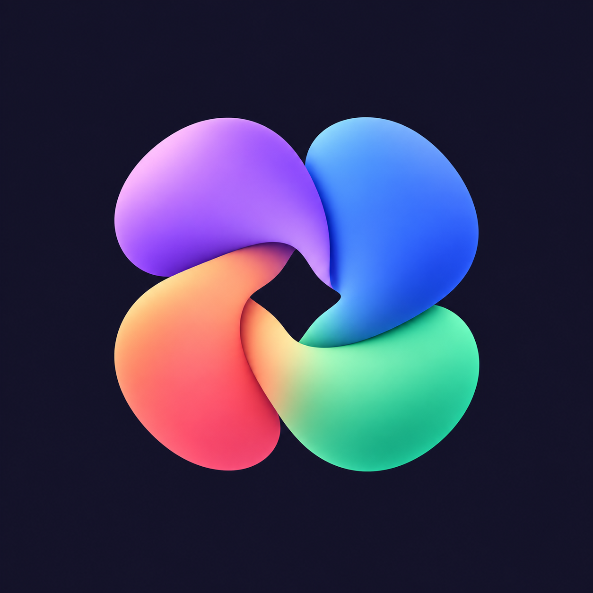

# Expressive Bloom app icon

The approved Expressive Bloom artwork is the app identity for Expressive Launcher.
Its violet, cobalt, coral and mint petals sit on an ink-indigo background (`#141329`).

The Expressive resource overlay supplies the application icon, Preferences icon,
round icon and themed icon for all Expressive Debug, QA and Release builds.
Separate upstream Lawnchair product flavors keep their own resource overlays.

## Assets and export

- `docs/assets/expressive/expressive-bloom.png`: approved opaque artwork for repository branding.
- `docs/assets/expressive/expressive-bloom-foreground.png`: transparent foreground artwork.
- `expressive/res/drawable-xxxhdpi/ic_launcher_expressive_foreground.png`: 432px color layer.
- `expressive/res/drawable-xxxhdpi/ic_launcher_expressive_monochrome.png`: matching white alpha silhouette.
- `fastlane/metadata/android/en-US/images/icon.png`: 512px listing artwork.

Run `swift scripts/export-expressive-icon.swift` from the repository root on macOS to
export the Android and listing assets from the approved source PNGs. The checked-in
exports are sufficient for Android builds on other platforms; Swift is not a build dependency.

The Android layers use a 108dp canvas at xxxhdpi. The visible mark is centered within
the 66dp safe circle, with an extra pixel for edge antialiasing. A separate monochrome
silhouette allows wallpaper-based tinting without including the opaque background.
See [Android adaptive icon requirements](https://developer.android.com/develop/ui/compose/system/icon_design_adaptive).

The artwork was generated with the built-in image-generation tool and approved in
the design task. Exporting resources preserves the artwork; future APKs consume the
same checked-in layers through the shared Expressive source set.
